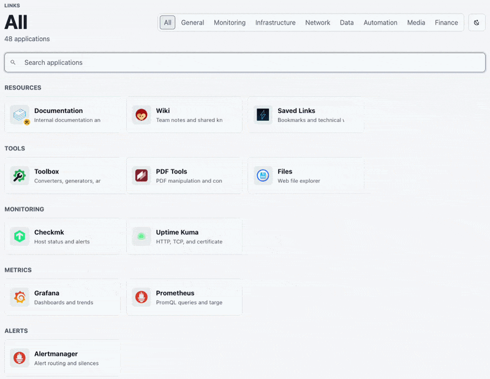

# Shortcuter

Read-only shortcuts dashboard backed by a YAML file. It can be used as an internal company shortcuts portal for teams, departments, or shared services.

The Docker image serves both the FastAPI backend and the Vue frontend.



## Quick Start

```bash
docker run -d --name shortcuter -p 8000:8000 -v "$(pwd)/shortcuts.yaml:/shortcuts.yaml:ro" gbnk0/shortcuter:latest
```

Open:

```text
http://localhost:8000
```

The command starts the Docker Hub image with your local `shortcuts.yaml` mounted as read-only config.

## Configure

Create your private local config:

```bash
cp shortcuts.example.yaml shortcuts.yaml
```

Minimal YAML:

```yaml
general:
  title: Shortcuter
  subtitle: Internal apps and services
  rubrique: Links
  accent: green
  display_density: comfortable
  language: auto
  logo: /logo.png
  show_all_tab: true
  show_footer: true
  show_theme_toggle: true
  show_density_toggle: true
  add_tab_name_on_duplicate_app: true

pages:
  - title: General
    subtitle: Daily quick access
    rubrique: Home
    accent: green
    shortcuts:
      - name: Kibana
        url: https://kibana.example.lan
        group: Monitoring
        description: Dashboards and metrics
        icon: homarr/kibana
```

Icon values can be:

- `auto`
- a Material Design Icons class, such as `mdi-server`
- a Homarr Labs icon, such as `homarr/kibana`
- an image URL

Optional shortcut badge:

```yaml
badge:
  icon: mdi-hammer-wrench
  tooltip: Maintenance in progress
```

When `general.add_tab_name_on_duplicate_app` is enabled, duplicate shortcut names across tabs are displayed as `App Name (Tab Name)`.

Set `general.display_density` to `comfortable` or `compact` to choose the default card spacing.

Set `general.language` to `auto`, `en`, `fr`, `es`, or `de` to choose built-in UI labels.

Set `general.logo` to a local public path or external URL for custom branding. Favicons and touch icons use that logo automatically unless you override `general.favicon`, `general.favicon_png`, `general.apple_touch_icon`, or `general.icon_192`.

Set `general.show_footer`, `general.show_theme_toggle`, or `general.show_density_toggle` to `false` to hide those controls.

## Local Development

API:

```bash
cd api
python3.13 -m venv .venv
. .venv/bin/activate
pip install -r requirements.txt
uvicorn app.main:app --host 0.0.0.0 --port 8000
```

UI:

```bash
cd ui
npm install
VITE_API_URL=http://localhost:8000 npm run dev -- --host 0.0.0.0 --port 5173
```

Open `http://localhost:5173`.

## Acknowledgements

Shortcuter can use icons from [Homarr Labs Dashboard Icons](https://github.com/homarr-labs/dashboard-icons), which is licensed under the [Apache License 2.0](https://github.com/homarr-labs/dashboard-icons/blob/main/LICENSE). Product names, trademarks, and registered trademarks remain the property of their respective owners.
